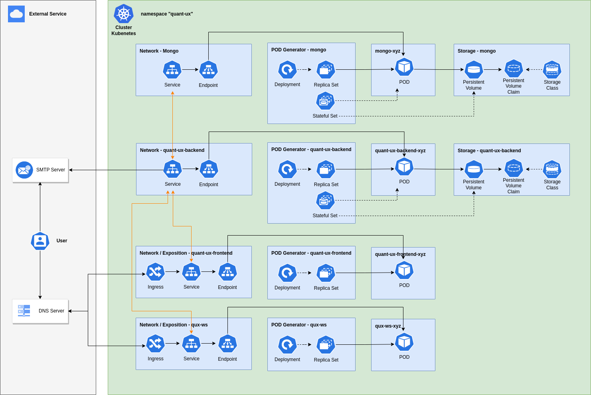
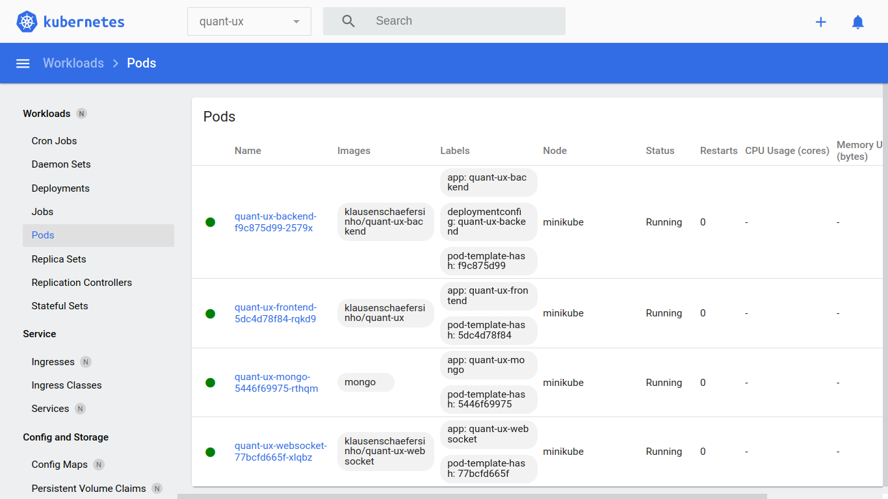

# Quant-UX k8s with Nginx Ingress
This repository contains manifest files for deploying the beautiful prototyping application [Quant-UX](https://github.com/KlausSchaefers/quant-ux) on a k8s cluster.

These manifest files can be deployed in local development environment using [minikube](https://minikube.sigs.k8s.io/).

# Kubernetes Architecture



## Local Development Environment Requirements

To deploy the k8s manifest files from this repository in the local development environment, it is necessary to install the following applications:

- [Docker v20.10.14](https://docs.docker.com/engine/install/ubuntu/)
- [Minikube v1.29.0](https://minikube.sigs.k8s.io/docs/start/#:~:text=1-,Installation,-Click%20on%20the)
- [Kubectl v1.26.0](https://kubernetes.io/docs/tasks/tools/install-kubectl-linux/)

The development environment was built on a Linux distro based on **Ubuntu 18.04 LTS**.

## Deploying

After installing the `Docker`, `Minikube` and `Kubectl` applications, from a terminal with administrator access (but not logged in as root), run to create a cluster locally:

```
minikube start
```

Enable ingress addon:

```
minikube addons enable ingress
```

Clone the repository:

```
git clone https://github.com/engmsilva/quant-ux-k8s.git
```

Run the deployment on the cluster:

```
cd quant-ux-k8s
kubectl apply -f ./k8s
```

Run the `Minikube Dashboard`, select the `quant-ux` namespace in the top bar and then the `Pods` menu in the left side menu bar. Wait until all `Pods` are in `Running` status:

```
minikube dashboard
```




Check the local IP that is being routed to the cluster services:

```
kubectl get ingress --namespace=quant-ux

NAME            CLASS     HOSTS            ADDRESS        PORTS     AGE
nginx-ingress   nginx     quant-ux.local   192.168.49.2   80        13h
```

Add the IP from the **ADDRESS** column in the `/etc/hosts` file to resolve name to address [http://quant-ux.local](http://quant-ux.local):

```
192.168.49.2 quant-ux.local
```

Restart the networking service:

```
sudo service network-manager restart
```

Once all steps are completed Quant-UX will be available locally at the url [http://quant-ux.local](http://quant-ux.local).

## Email Service

Quant-UX needs an email service to send messages to registered users in the application.

In the manifest file, the email service [ethereal](https://ethereal.email) was configured. Ethereal is a fake free SMTP service where messages are never delivered which serves the purpose of development environment.

Messages delivered by Quant-UX can be viewed [here](https://ethereal.email/login), using the credentials below:

```
Email address: ron59@ethereal.email
Password:UmA7RukSJvQ2FYjKcx
```

**note:** The fake Etheral SMTP service account is temporary, you may need to register a new account and change the information in the `06-qux-be-configmap.yaml` manifest.

## Secrets

The information passed in the secret manifest must be in `Base64` format:

```
echo -n "stringtoencode" | base64
```
**note:** Quant-UX does not decode the secret manifest information. This manifest has been added to the repository with just an environment variable that doesn't need decoding just to exemplify good practices for using [security sensitive information in k8s](https://kubernetes.io/docs/concepts/configuration/secret/).

